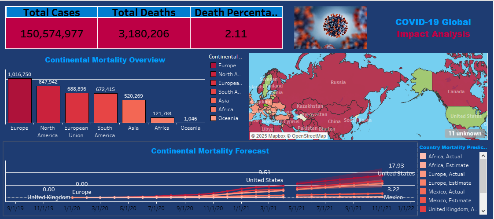
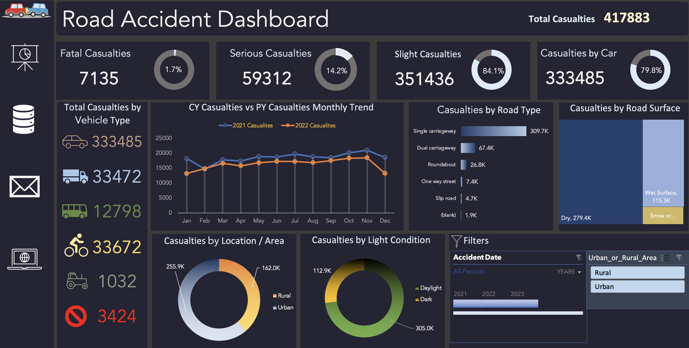

# Data Analyst | BI Developer  
 

## 👤 Profile  
Results-oriented Data Analyst with a passion for turning raw data into meaningful insights. Specializing in data analysis, visualization, and business intelligence, I excel at uncovering trends, identifying opportunities, and delivering data-driven solutions that drive business success. With a strong foundation in advanced analytical tools and techniques, I am dedicated to helping organizations make informed decisions and achieve their strategic objectives.  

---

## 🛠️ **Technical Skills**  
    
    
    

- **Data Querying & Warehousing**: Advanced SQL Server, Data Warehouse Design, ETL Processes  
- **Data Visualization**: Power BI, Tableau, Excel (Pivot Tables, Advanced Functions, Macros)  
- **Programming**: Python (Pandas, NumPy, Matplotlib, Seaborn, Plotly, Scikit-learn, Machine Learning Models)  
- **Cloud & Big Data**: Microsoft Azure (Basics), Big Data Fundamentals  
- **Statistical Analysis**: Statistics, Probability, Hypothesis Testing, Predictive Modeling  

---

## 🌟 **Interpersonal Skills**  
- **Presentation Skills**: Delivering clear and impactful data-driven presentations to stakeholders.  
- **Communication Skills**: Translating complex data insights into actionable business recommendations.  
- **Leadership**: Leading cross-functional teams to achieve project goals.  
- **Problem Solving**: Identifying and resolving data-related challenges with innovative solutions.  
- **Time Management**: Delivering projects on time while maintaining high-quality standards.  

---

## 🎓 **Education**  
**Bachelor of Science in Statistics** | Minor in Statistics | Good  
*2020–2024*  

---

## 📜 **Training & Certifications**  
- **Digital Egypt Pioneers Initiative (DEPI)** | *Ministry of Communications and Information Technology (MCIT)*  
  - Data Analysis Track | *May 2024 – Present*  
  - Gained hands-on experience in data analysis, visualization, and business intelligence tools.  

### 🏆 **Certifications**  

- **Microsoft SQL - DataCamp**  
    

- **Tableau Desktop Specialist - Intermediate**  
    

---

## 💼 **Projects**  

### **1. COVID-19 Portfolio Project | SQL & Tableau**  
  

  

- Conducted a comprehensive analysis of global COVID-19 data, including infection rates, mortality rates, and vaccination trends.  
- Built interactive dashboards in Tableau to visualize key metrics.  

---

### **2. Road Accident Dashboard | Advanced Excel & Power Query**  
  

- Developed a dynamic Excel dashboard using Power Query and Pivot Tables to analyze road accident data.  
- Key insights included:  
  - Monthly trends in accidents for 2021 and 2022.  
  - Analysis of casualty types, vehicle types, and road conditions.  
  - Geographic hotspots for accidents.  
- **Impact**: Provided actionable insights to improve road safety measures and reduce accidents.  
  

---

## 🌐 **Languages**  
- **Arabic**: Native  
- **English**: Professional Proficiency  

---

## 🚀 **What Sets Me Apart**  
- **Data Storytelling**: I don’t just analyze data; I tell stories that drive action. My dashboards and reports are designed to be intuitive and impactful.  
- **Continuous Learning**: I stay updated with the latest trends in data analytics and BI tools to deliver cutting-edge solutions.  
- **Client-Centric Approach**: I focus on understanding the client’s needs and delivering solutions that align with their business goals.  

---
 
## 📞 **Let’s Connect!**
I'm always open to new opportunities and collaborations. Feel free to reach out:
- **Email**: [omarrageb341@gmail.com](mailto:omarrageb341@gmail.com)  
- **LinkedIn**: [LinkedIn Profile](https://www.linkedin.com/in/omar-rageb)  
-  **Phone**: [01005506286](tel:+201005506286)  
